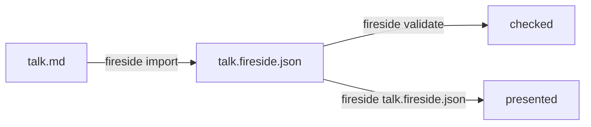

Fireside decks are protocol JSON, but you don't have to write JSON by hand.
`fireside import talk.md` compiles a Markdown file into a deck: each `##`
heading becomes a node, in document order, and a small fence syntax
declares branch points. This is the fastest way from a talk outline to a
presentable deck.

## The shape



Every `##` heading starts a new node. Its slugified heading text becomes the
node's id (`## Core Features` → `core-features`), and its heading level-2
text becomes the node's title. Everything between one `##` and the next
becomes that node's content.

## A linear talk

```markdown
---
title: My Talk
author: Ada Lovelace
---

## Welcome

Thanks for coming. Here's what we'll cover.

- Point one
- Point two

## The Code

​```rust
fn main() {
    println!("hello");
}
​```

## Thanks

Questions?
```

Optional YAML-ish frontmatter (`title`, `author`, `date`, `description`,
`fireside-version`) sets deck metadata. Without frontmatter, a leading `#`
(H1) heading before the first `##` is used as the deck title instead.

Nodes wire together in document order automatically: `welcome` → `the-code`
→ `thanks`, with `thanks` terminal since nothing follows it. Run it:

```sh
fireside import talk.md
fireside validate talk.fireside.json
fireside talk.fireside.json
```

## What each Markdown element becomes

| Markdown                          | Content block                          |
| ---------------------------------- | ---------------------------------------- |
| `##` heading                       | Starts a new node; its text is the node's `title` |
| paragraph text                     | `text` block, inline `**bold**`/`_italic_`/`` `code` `` preserved |
| `- item` / `1. item`               | `list` block (`ordered: true` for numbered lists) |
| fenced code block                  | `code` block, language tag preserved   |
| a paragraph containing only one image | `image` block (`alt`/title captured) |
| `---` horizontal rule              | `divider` block                        |

**Nested lists are rejected, not flattened.** `import` fails with the line
number of the nested item rather than silently losing structure — flatten
the list, or hand-edit the generated JSON afterward.

## Branch points

A ` ```branch ` fence is the last thing in a section and turns that node
into a branch point instead of a linear step:

```markdown
## Choose your path

​```branch
What would you like to see?
- [Explore the features](#core-features) `f`
- [Watch a demo](#code-demo) `d`
​```

## Core Features

Some features.

## Code Demo

​```rust
fn demo() {}
​```
```

The first line of the fence is the prompt. Each following line is
`- [label](#target-slug)` with an optional `` `key` `` — the backtick-quoted
single character a presenter can press to choose that option directly.
`#target-slug` must match another section's heading slug in the same
document; an unresolved target fails the import with the line number and
the slug it couldn't find. Content after a `branch` fence within the same
section is also rejected — the fence must be the section's last element.

## What v1 import doesn't carry over

Import is deliberately a compiler for the common case, not a full protocol
surface. It doesn't produce columns/multi-column containers, per-slide
`view-mode` or `transition` overrides, or speaker notes — `fireside import`
prints a reminder of this after every successful run. Add any of those by
hand-editing the generated JSON, or with quick-edit (`e` while presenting)
for headings and text.

## Validation is not optional

`import` runs the generated deck through the same Layer-2 validation as
`fireside validate` before writing anything. If the compiled deck would fail
validation — for instance, two branch options that both need the same key —
`import` reports it and writes nothing, rather than handing you a broken
file to debug after the fact.

## Re-running import

`import` refuses to overwrite an existing output file, so a second
`fireside import talk.md` after you've hand-edited `talk.fireside.json`
fails rather than clobbering your edits — pick a different name, or delete
the old file first if you intend to regenerate from scratch.
