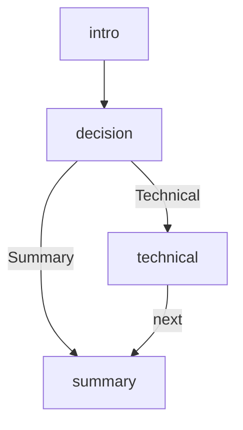

Most decks are created with `fireside new` or compiled from Markdown with
`fireside import` — see the [Quickstart](/guides/quickstart/) if that's what
you're after. This guide is the deep dive for the other path: hand-writing a
deck's JSON directly, to see the protocol's graph model up close.

The point of the example is not to show every feature in the protocol. It is to
show the smallest graph that still demonstrates entry, branching, rejoin, and a
terminal node.

## Requirements

The presenter renders with 24-bit RGB colors and has no 256-color fallback, so
you'll need a truecolor terminal (most modern terminal emulators; set
`COLORTERM=truecolor` if colors look off). It also expects a monospace font
with Unicode box-drawing support, and is most comfortable at ~80 columns by
24 rows or larger — narrower windows still work, but content wraps tighter.

## What you will make

A four-node graph with one entry node, one branch point, one optional detail
path, and one shared ending.



## Start with the graph

Create `my-graph.fireside.json`:

The example below is a complete `Graph` document, not a partial JSON fragment.

```json
{
  "fireside-version": "0.1.0",
  "title": "My First Fireside Graph",
  "nodes": [
    {
      "id": "intro",
      "content": [
        { "kind": "heading", "level": 1, "text": "Welcome" },
        { "kind": "text", "body": "Fireside graphs are branching presentations." }
      ],
      "traversal": "decision"
    },
    {
      "id": "decision",
      "content": [
        {
          "kind": "container",
          "layout": "center",
          "children": [
            { "kind": "heading", "level": 2, "text": "Pick a path" },
            {
              "kind": "text",
              "body": "Choose technical detail or a broader summary."
            }
          ]
        }
      ],
      "traversal": {
        "branch-point": {
          "prompt": "Where do you want to go next?",
          "options": [
            { "label": "Technical", "key": "t", "target": "technical" },
            { "label": "Summary", "key": "s", "target": "summary" }
          ]
        }
      }
    },
    {
      "id": "technical",
      "view-mode": "fullscreen",
      "transition": "fade",
      "traversal": "summary",
      "content": [
        {
          "kind": "code",
          "language": "rust",
          "source": "fn main() {\n    println!(\"Hello, Fireside!\");\n}"
        }
      ]
    },
    {
      "id": "summary",
      "content": [
        {
          "kind": "container",
          "layout": "center",
          "children": [
            { "kind": "heading", "level": 1, "text": "Thanks" },
            {
              "kind": "text",
              "body": "That was a tiny graph with an explicit rejoin."
            }
          ]
        }
      ]
    }
  ]
}
```

## Read the shape

Read from left to right, the graph starts at `intro`, moves to `decision`, and
then either goes directly to `summary` or detours through `technical` before
rejoining. `decision` blocks `next` and waits for `choose`, while `summary` is
terminal because it omits `traversal` entirely.

## Why this structure works

This is a good first example because every node has a clear role. There is one
entry point, one decision point, one optional detail path, and one shared end.
That is enough structure to show the protocol’s core ideas without drowning the
reader in extra branches.

## Run it

```sh
fireside validate my-graph.fireside.json
fireside my-graph.fireside.json
```

`validate` checks the file for schema and semantic problems before you
present it; the second command presents it. Both live-reload-aware — if you
keep editing the JSON while `fireside my-graph.fireside.json` is running, the
slide on screen updates in place on save.

## A note on images

A plain `image` block (`{ "kind": "image", "src": "..." }`) is a deliberate
placeholder in the reference presenter — it renders a labeled frame sized to
its `alt` text, not the actual pixels. Real image rendering is out of scope
for 0.1.0 (see [Appendix C, Engine Extensions](/spec/appendix-engine-extensions/)).
If you want a photo or a title banner to actually show up on screen, convert
it to text art first with `fireside art image`/`fireside art text` and use an
`ascii-art` block instead — see
[Authoring a Deck in Markdown](/guides/authoring-markdown/#ascii-art) for a
worked example.

## What to try next

- add another branch point inside `technical`
- swap the `container` from `center` to `stack`
- change `summary` to a terminal node with no traversal
