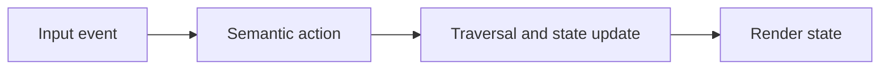

This appendix is non-normative. It documents practical runtime patterns that
fit the Fireside protocol without extending or redefining it.

## Core Runtime Guarantees

Robust engines tend to share a few operational guarantees, even though the
protocol does not require a specific implementation architecture.

1. Graph data is immutable after load and validation.
2. State mutation happens in one update path.
3. History is maintained as a strict LIFO stack.
4. Rendering is deterministic for equivalent state.

## Engine boundaries

These are practical boundaries, not protocol requirements. Keeping them clear
usually makes engines easier to test and reason about.

- Keep protocol state separate from view state.
- Keep input mapping separate from traversal semantics.
- Keep rendering hints separate from protocol rules.

## Container Rendering Guidance

For `container` blocks:

- Treat `children` as a local composition tree.
- Resolve container `layout` before laying out children.
- Preserve child order unless the selected layout explicitly reflows it.

## Input and Error Strategy

Map key events to semantic actions before state updates, keep presenter-facing
failures recoverable where possible, and favor placeholders over crashes for
content-level issues.
