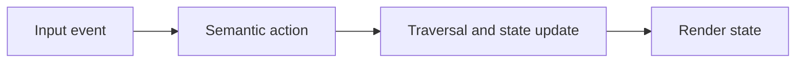

This appendix is non-normative. It documents practical runtime patterns that
fit the Fireside protocol without extending or redefining it.

## Core Runtime Guarantees

Robust engines tend to share a few operational guarantees, even though the
protocol does not require a specific implementation architecture.

1. Graph data is immutable after load and validation.
2. State mutation happens in one update path.
3. History is maintained as a strict LIFO stack.
4. Rendering is deterministic for equivalent state.

## Engine boundaries

These are practical boundaries, not protocol requirements. Keeping them clear
usually makes engines easier to test and reason about.

- Keep protocol state separate from view state.
- Keep input mapping separate from traversal semantics.
- Keep rendering hints separate from protocol rules.

## Container Rendering Guidance

For `container` blocks:

- Treat `children` as a local composition tree.
- Resolve container `layout` before laying out children.
- Preserve child order unless the selected layout explicitly reflows it.

## Input and Error Strategy

Map key events to semantic actions before state updates, keep presenter-facing
failures recoverable where possible, and favor placeholders over crashes for
content-level issues.

## ViewMode Toggle Persistence

When an engine lets a presenter toggle `ViewMode` at runtime (§Enums), the
toggle SHOULD persist across node transitions until the presenter
explicitly toggles it again — it should not silently reset to the node's
declared value on the next `Next`/`Choose`/`Goto`/`Back`. The reference
implementation stores the toggle as a single override that participates in
the resolution order ahead of the node-level value, and never clears it on
navigation.

## Image Overflow Handling

For `ImageBlock`, engines MUST clamp a requested `width`/`height` to the
available content area rather than clipping content unpredictably or
rejecting the document. This is forward guidance for engines that render
images at their requested dimensions; the reference renderer currently
displays a placeholder box that sizes itself to its alt text and does not
yet interpret `width`/`height` at all, since real image rendering is a
deferred follow-up.

## History Growth

Engines MAY cap the length of the history stack for long-running
presentations (for example, to bound memory on decks with many `goto`
loops). The reference implementation (`fireside-engine`'s `Session`) does
not currently impose a cap.
