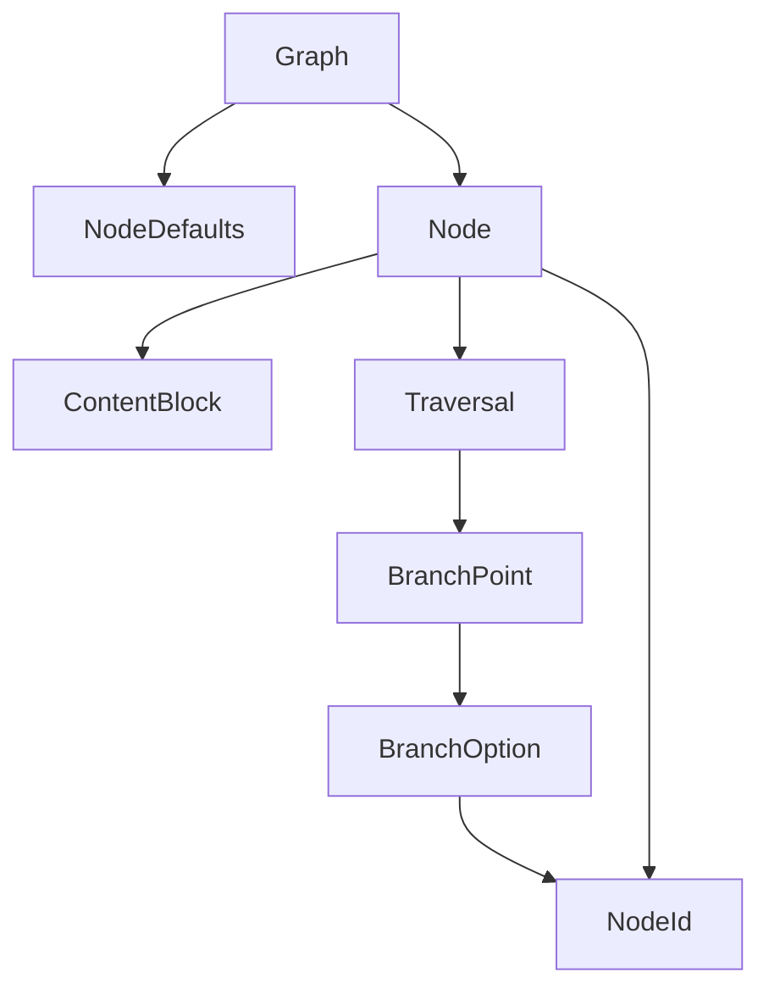

This chapter defines the protocol data model.

The easiest way to read the model is from the outside in. A `Graph` owns the
document, a `Node` holds content and optional traversal, and `ContentBlock`
variants describe what appears within a node.

## Model Relationships

At a glance, the `Graph` contains `Node` values, each `Node` contains
`ContentBlock` values, and traversal structures connect nodes by `NodeId`.

## Graph

A `Graph` is the complete Fireside document. It holds metadata, optional
defaults, and the ordered array of nodes that make up the presentation.

| Property           | Type            | Required | Notes                                             |
| ------------------ | --------------- | -------- | ------------------------------------------------- |
| `fireside-version` | `Versions?`     | No       | Protocol version label.                           |
| `title`            | `string?`       | No       | Human-readable graph title.                       |
| `author`           | `string?`       | No       | Author metadata.                                  |
| `date`             | `string?`       | No       | ISO 8601 recommended.                             |
| `description`      | `string?`       | No       | Summary metadata.                                 |
| `version`          | `string?`       | No       | Semantic version of the graph.                    |
| `defaults`         | `NodeDefaults?` | No       | Default view mode and transition.                 |
| `nodes`            | `Node[]`        | Yes      | `minItems: 1`. The first node is the entry point. |

## NodeDefaults

`NodeDefaults` provides graph-wide fallback values. A node can override them,
but it does not have to repeat them.

| Property     | Type          | Required | Notes                       |
| ------------ | ------------- | -------- | --------------------------- |
| `view-mode`  | `ViewMode?`   | No       | Default presentation frame. |
| `transition` | `Transition?` | No       | Default pacing hint.        |

## Node

A `Node` is the unit a presenter visits. It carries the content to render and,
optionally, the traversal rule that determines how the presenter leaves it.

| Property        | Type                    | Required | Notes                                                        |
| --------------- | ----------------------- | -------- | ------------------------------------------------------------ |
| `id`            | `NodeId`                | Yes      | Unique graph identifier.                                     |
| `title`         | `string?`               | No       | Human-readable node title.                                   |
| `view-mode`     | `ViewMode?`             | No       | Presentation frame hint.                                     |
| `transition`    | `Transition?`           | No       | Pacing hint when entering.                                   |
| `speaker-notes` | `string?`               | No       | Presenter-only notes.                                        |
| `traversal`     | `NodeId` or `Traversal` | No       | String shorthand, object form, or absent for terminal nodes. |
| `content`       | `ContentBlock[]`        | Yes      | Renderable blocks.                                           |

`view-mode` and `transition` resolve in this order:

1. node-level value
2. graph `defaults`
3. built-in default

## ContentBlock Union

`ContentBlock` is a tagged union keyed by `kind`. Conforming engines must
support the seven core block kinds shown below.

| Kind        | Purpose                                                       |
| ----------- | ------------------------------------------------------------- |
| `heading`   | Section titles and hierarchy.                                 |
| `text`      | Prose or narrative text.                                      |
| `code`      | Source code with optional language and highlighting metadata. |
| `list`      | Ordered or unordered string lists.                            |
| `image`     | Visual assets with accessibility and sizing metadata.         |
| `divider`   | Visual separation between sections.                           |
| `container` | Nested block composition with a layout hint.                  |

### ContainerBlock

`container` is the composition primitive. It groups child blocks and adds a
layout hint for the local arrangement of those children.

| Property   | Type             | Required            | Notes                                               |
| ---------- | ---------------- | ------------------- | --------------------------------------------------- |
| `kind`     | `"container"`    | Yes                 | Tagged union discriminator.                         |
| `children` | `ContentBlock[]` | Yes (`minItems: 1`) | Child block order is significant.                   |
| `layout`   | `string?`        | No                  | Common values are `stack`, `columns`, and `center`. |

## Traversal Types

`Traversal` is the object form used when a node needs more than the simple
string shorthand.

- `next`: explicit next target
- `branch-point`: branch prompt with `options`

`Traversal` MUST NOT contain both `next` and `branch-point`.

The string shorthand on `Node.traversal` remains valid for the simple
single-edge case.

### BranchPoint

| Property  | Type             | Required            | Notes                          |
| --------- | ---------------- | ------------------- | ------------------------------ |
| `prompt`  | `string?`        | No                  | Prompt shown to the presenter. |
| `options` | `BranchOption[]` | Yes (`minItems: 1`) | Available choices.             |

### BranchOption

| Property      | Type      | Required | Notes                               |
| ------------- | --------- | -------- | ----------------------------------- |
| `label`       | `string`  | Yes      | Display label for the option.       |
| `key`         | `string?` | No       | Optional shortcut key.              |
| `target`      | `NodeId`  | Yes      | Target node ID.                     |
| `description` | `string?` | No       | Additional presenter-facing detail. |

`BranchOption.target` values MUST resolve to existing node IDs.

## NodeId Scalar

`NodeId` is a non-empty string scalar used for node identifiers and traversal
targets. Node IDs MUST be unique within a graph and SHOULD use kebab-case.

## Enums and Version

The current protocol version is `0.1.0`. `ViewMode` currently defines
`default` and `fullscreen`, and `Transition` currently defines `none` and
`fade`.
