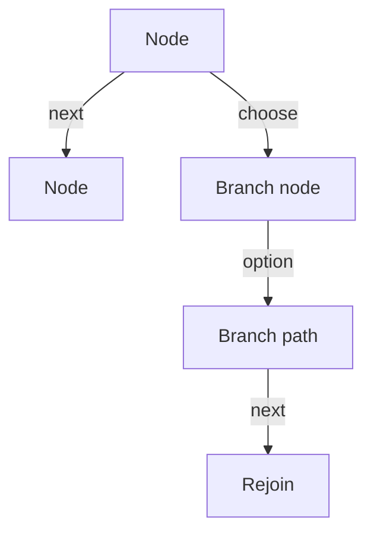

## The short version

Fireside is for content that behaves like a graph, not a deck.

If PowerPoint is a stack of slides, Fireside is a network of scenes with
explicit exits.

## What problem it solves

Use Fireside when you need:

1. branching paths that stay readable
2. reusable content that can be revisited from more than one place
3. explicit return paths instead of hidden slide order
4. a presentation format that matches technical or decision-heavy content

## Three mental models

### For authors

Think in nodes, not slides.

Each node is one beat in the presentation. A node may:

- show content
- offer a choice
- lead to one next node
- stop

### For presenters

Think in moves.

The presenter has four actions:

- `next`
- `choose`
- `goto`
- `back`

Those actions walk a graph, not a linear sequence.

### For engine authors

Think in state.

A conforming runtime needs only:

- the current node ID
- a history stack of node IDs
- a node lookup table

Rendering chrome, themeing, and animation are implementation concerns.

## Why not PowerPoint

| Need | PowerPoint | Fireside |
| --- | --- | --- |
| Branching paths | Awkward | Native |
| Revisit earlier content | Manual | Built in |
| Shared subflows | Copy/paste | Explicit graph edges |
| Presenter recovery | Slide order only | `back()` and `goto()` |
| Technical content | Can work | Fits naturally |

PowerPoint is fine for linear storytelling.
Fireside is for content where choice and return paths are part of the story.

## Good authoring habits

- name nodes after meaning, not sequence
- make branch points decision-shaped
- wire rejoins explicitly
- keep terminal nodes obvious
- prefer small reusable nodes over giant all-in-one nodes

## A useful diagram

