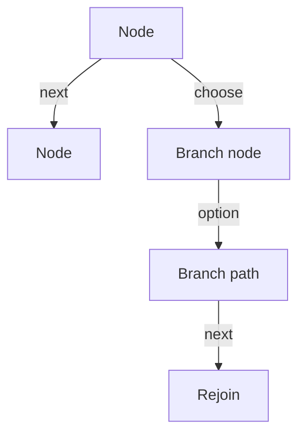

## The short version

Fireside is for content that behaves like a graph, not a deck.

If PowerPoint is a stack of slides, Fireside is a graph of nodes with
explicit exits.

That shift matters because it changes what authors have to model. Instead of
assuming “the next thing is whatever comes after this one,” Fireside asks the
author to make each exit explicit.

## What problem it solves

Fireside is most useful when the structure of the presentation matters as much
as the content itself. It works well when branching, revisiting, or rejoining
is part of the normal flow rather than an edge case.

1. branching paths that stay readable
2. reusable content that can be revisited from more than one place
3. explicit return paths instead of hidden slide order
4. a presentation format that matches technical or decision-heavy content

## Three mental models

### For authors

Think in nodes, not slides.

Each node is one discrete unit in the presentation. A node may:

- show content
- offer a choice
- lead to one next node
- stop

The important shift is that node order in the file is not the same thing as
presentation order. Traversal controls movement; the node array is primarily a
document container.

### For presenters

Think in moves.

The presenter has four actions:

- `next`
- `choose`
- `goto`
- `back`

Those actions walk a graph, not a linear sequence.

This makes presenter behavior easier to reason about. `Next` follows an
explicit edge, `Choose` resolves a branch, `Goto` jumps directly by node ID,
and `Back` returns through history instead of guessing from layout.

### For engine authors

Think in state.

A conforming runtime needs only:

- the current node ID
- a history stack of node IDs
- a node lookup table

Rendering chrome, theming, and animation are implementation concerns. The
protocol stays small by separating those concerns from graph state.

## Why not PowerPoint

| Need                    | PowerPoint       | Fireside              |
| ----------------------- | ---------------- | --------------------- |
| Branching paths         | Awkward          | Native                |
| Revisit earlier content | Manual           | Built in              |
| Shared subflows         | Copy/paste       | Explicit graph edges  |
| Presenter recovery      | Slide order only | `back()` and `goto()` |
| Technical content       | Can work         | Fits naturally        |

PowerPoint is fine for linear storytelling.
Fireside is for content where choice and return paths are part of the story.

## Good authoring habits

The most reliable Fireside documents tend to follow the same habits: name nodes
after meaning rather than sequence, make branch points feel like real decisions,
wire rejoins explicitly, keep terminal nodes obvious, and prefer small reusable
nodes over one large catch-all node.

## A useful diagram

