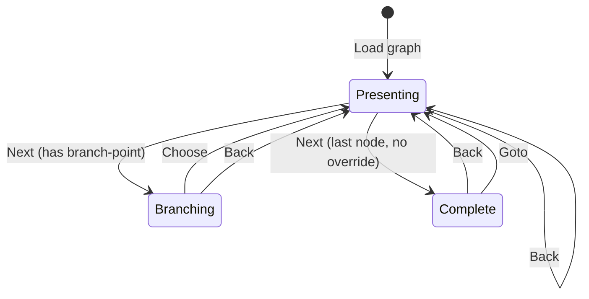
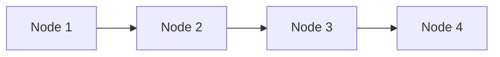
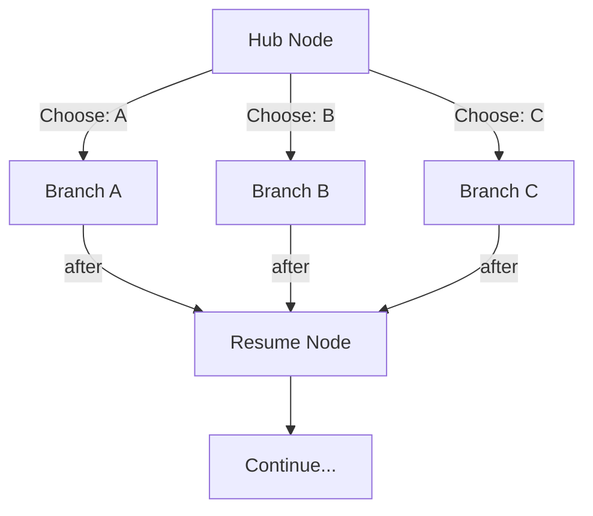
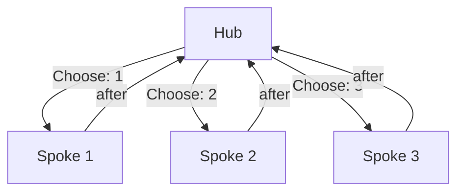
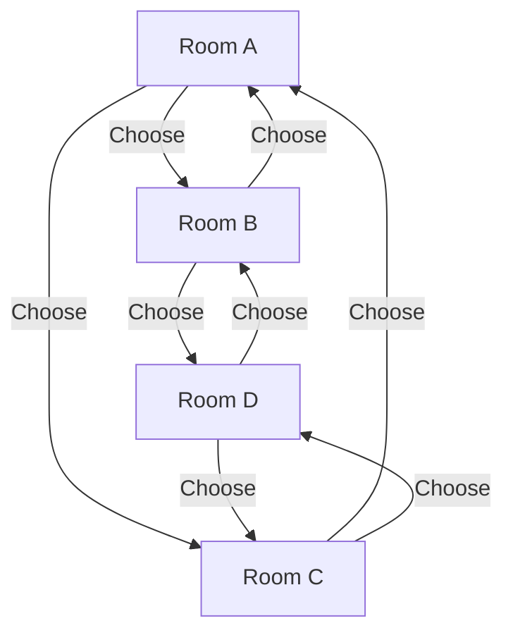

This section defines the behavioral contract for moving through a Fireside
graph. Four primitive operations govern all traversal. A conforming engine MUST
implement all four operations exactly as specified.

## Overview

| Operation  | Purpose                                  | History Effect     |
| ---------- | ---------------------------------------- | ------------------ |
| **Next**   | Advance to the next node in sequence.    | No push.           |
| **Choose** | Select a branch option at a BranchPoint. | Push current node. |
| **Goto**   | Jump directly to a node by ID.           | Push current node. |
| **Back**   | Return to the previous node in history.  | Pop top entry.     |

Every movement through the graph is reducible to one of these four operations.
Engines MUST NOT introduce additional traversal primitives that bypass the
history stack contract.

## Engine State

A conforming engine MUST maintain the following state:

| Field     | Type        | Initial Value | Description                                    |
| --------- | ----------- | ------------- | ---------------------------------------------- |
| `current` | `integer`   | `0`           | Index into `nodes[]` of the active node.       |
| `history` | `integer[]` | `[]`          | LIFO stack of previously visited node indices. |
| `state`   | `enum`      | `Presenting`  | Current state machine state.                   |

The `current` index MUST always be a valid index into the Graph's `nodes`
array. The `history` stack contains node indices (not NodeIds) to support
nodes without explicit identifiers.

## Next

The **Next** operation advances the presenter to the next node. It is the
default traversal when the presenter presses the "next" input.

### Algorithm

1. Let `node` be `nodes[current]`.
2. If `node.traversal.branch-point` is defined, the operation is a **no-op**.
   The engine MUST remain in the Branching state until Choose is invoked.
3. If `node.traversal.next` is defined:
   - Let `target` be the NodeId in `node.traversal.next`.
   - Resolve `target` to an index `j` in `nodes[]`.
   - If `target` does not resolve, the operation is a **no-op**. Engines
     SHOULD log a warning.
   - Set `current ← j`.
   - Transition to the **Presenting** state.
   - **Return.**
4. If `node.traversal.after` is defined:
   - Let `target` be the NodeId in `node.traversal.after`.
   - Resolve `target` to an index `j` in `nodes[]`.
   - If `target` does not resolve, continue to step 5. Engines SHOULD log a
     warning.
   - Set `current ← j`.
   - Transition to the **Presenting** state.
   - **Return.**
5. If `current < len(nodes) - 1`:
   - Set `current ← current + 1`.
   - Transition to the **Presenting** state.
   - **Return.**
6. The presenter has reached the last node. Transition to the **Complete**
   state.

### Resolution Priority

The Next operation checks three sources in strict priority order:

```text
traversal.next  →  traversal.after  →  nodes[i+1]  →  Complete
```

This ordering ensures that explicit overrides always take precedence over
implicit sequential edges, and branch return points (`after`) take precedence
over linear advance when a branch path has ended.

## Choose

The **Choose** operation selects a branch option at a BranchPoint. It is the
only way to leave a node that has a `branch-point` defined.

### Algorithm

1. Let `node` be `nodes[current]`.
2. Let `bp` be `node.traversal.branch-point`.
3. If `bp` is not defined, the operation is a **no-op**.
4. Let `option` be the selected BranchOption from `bp.options`.
5. Resolve `option.target` to an index `j` in `nodes[]`.
6. If `option.target` does not resolve, the operation is a **no-op**. Engines
   SHOULD display an error to the presenter.
7. Push `current` onto the `history` stack.
8. Set `current ← j`.
9. Transition to the **Presenting** state.

### Requirements

- Engines MUST display all options from `bp.options` in array order.
- If `bp.prompt` is defined, engines MUST display it before the options.
- When an option has a `key` property, engines SHOULD allow selection via that
  keystroke.
- When options lack `key` properties, engines MUST provide an alternative
  selection mechanism (numbered list, arrow keys, mouse, etc.).

## Goto

The **Goto** operation jumps directly to any node by its NodeId, bypassing
graph topology. It is typically triggered by a "go to" command or bookmark.

### Algorithm

1. Let `targetId` be the requested NodeId.
2. Resolve `targetId` to an index `j` in `nodes[]`.
3. If `targetId` does not resolve, the operation is a **no-op**. Engines
   SHOULD display an error or warning.
4. Push `current` onto the `history` stack.
5. Set `current ← j`.
6. Transition to the **Presenting** state.

### Notes

- Goto is an unconditional jump. It does not check for branch points, `next`
  overrides, or `after` fields on the current node.
- Goto pushes to the history stack, preserving Back functionality.
- Engines MAY restrict Goto to nodes that have explicit `id` values.
  Nodes without IDs are not addressable by Goto.

## Back

The **Back** operation returns the presenter to the previously visited node by
popping the history stack. It enables undo-style backtracking.

### Algorithm

1. If the `history` stack is empty, the operation is a **no-op**.
2. Pop the top entry from `history`. Let the popped value be `j`.
3. Set `current ← j`.
4. Transition to the **Presenting** state.

### Notes

- Back does NOT push to the history stack. Repeated Back operations walk
  backward through history without growing the stack.
- After a Back, the presenter is at the node they were at before the
  corresponding Choose or Goto. The Next operation proceeds from that node
  using the normal resolution algorithm.
- Engines SHOULD provide visual feedback when the history stack is empty and
  Back is invoked (e.g., an indicator or gentle refusal).

## History Stack Contract

The history stack is a LIFO (last-in, first-out) data structure of node
indices maintained by the engine.

### Invariants

A conforming engine MUST uphold these invariants:

1. **Choose pushes.** Every Choose operation pushes the current node index
   onto the stack before navigating to the target.
2. **Goto pushes.** Every Goto operation pushes the current node index onto
   the stack before navigating to the target.
3. **Back pops.** Every Back operation pops the top entry and navigates to it.
   If the stack is empty, the operation is a no-op.
4. **Next does not push.** The Next operation (including `traversal.next` and
   `traversal.after` resolution) MUST NOT modify the history stack.
5. **Back does not push.** The Back operation MUST NOT push to the stack.
6. **Stack integrity.** Engines MUST NOT insert, remove, or reorder entries
   except through the Choose/Goto push and Back pop operations described above.

### Rationale

The asymmetry between Next (no push) and Choose/Goto (push) reflects their
semantic intent:

- **Next** is a linear advance — the presenter moves forward through a
  sequence. There is no need to record the origin because the sequence is
  implicit in array order.
- **Choose** and **Goto** are non-linear jumps — the presenter leaves the
  current context to visit another part of the graph. The origin must be
  recorded to enable backtracking.

## State Machine

A conforming engine MUST implement the following three-state machine:



### States

| State          | Description                                                                                        |
| -------------- | -------------------------------------------------------------------------------------------------- |
| **Presenting** | The engine is displaying a node's content. The presenter may invoke Next, Goto, or Back.           |
| **Branching**  | The engine is displaying a BranchPoint. The presenter MUST invoke Choose or Back. Next is a no-op. |
| **Complete**   | The presenter has reached the end of the graph. Back and Goto remain available. Next is a no-op.   |

### Transitions

| From       | Operation | Condition               | To         |
| ---------- | --------- | ----------------------- | ---------- |
| Presenting | Next      | Successor node exists   | Presenting |
| Presenting | Next      | Node has `branch-point` | Branching  |
| Presenting | Next      | Last node, no override  | Complete   |
| Presenting | Goto      | Target exists           | Presenting |
| Presenting | Back      | History non-empty       | Presenting |
| Branching  | Choose    | Valid option selected   | Presenting |
| Branching  | Back      | History non-empty       | Presenting |
| Complete   | Back      | History non-empty       | Presenting |
| Complete   | Goto      | Target exists           | Presenting |

Operations not listed in the table are no-ops in the given state. For example,
Next in the Complete state and Next in the Branching state produce no effect.

### Entering the Branching State

The engine enters the Branching state when a Next operation encounters a node
whose `traversal.branch-point` is defined. Specifically:

1. The engine enters the node normally (renders content, applies transition).
2. The engine detects `traversal.branch-point` on the current node.
3. The engine transitions to the Branching state.
4. The engine displays the branch point prompt and options.
5. The engine blocks on presenter input: only Choose and Back are valid.

Note: a node MAY have both content and a `branch-point`. The engine MUST
render the node's content AND the branch-point UI simultaneously.

## The `after` Field

The `after` field on a Traversal defines a **return edge** — it tells the
engine where to go when a branch path reaches its natural end.

### Purpose

In a branch-and-return pattern, the presenter chooses a branch at a
BranchPoint, traverses the branch's nodes, and then returns to the main
sequence. The `after` field on the last node of a branch path specifies the
return destination.

### Semantics

When the Next algorithm reaches step 4, it checks `traversal.after`. If
present, the engine navigates to the specified NodeId instead of advancing to
`nodes[i+1]`. This creates an invisible "return edge" from the branch
terminus back to the main path.

### Example: Branch and Return

```json
{
  "nodes": [
    {
      "id": "intro",
      "content": [{ "kind": "heading", "level": 1, "text": "Welcome" }]
    },
    {
      "id": "choose-path",
      "traversal": {
        "branch-point": {
          "prompt": "Pick a topic:",
          "options": [
            { "label": "Topic A", "key": "a", "target": "topic-a" },
            { "label": "Topic B", "key": "b", "target": "topic-b" }
          ]
        }
      },
      "content": [{ "kind": "heading", "level": 2, "text": "Choose a Topic" }]
    },
    {
      "id": "topic-a",
      "traversal": { "after": "summary" },
      "content": [{ "kind": "text", "body": "Details about Topic A." }]
    },
    {
      "id": "topic-b",
      "traversal": { "after": "summary" },
      "content": [{ "kind": "text", "body": "Details about Topic B." }]
    },
    {
      "id": "summary",
      "content": [{ "kind": "heading", "level": 2, "text": "Summary" }]
    }
  ]
}
```

In this example:

- The presenter reaches `choose-path` and sees the BranchPoint.
- Choosing "Topic A" navigates to `topic-a` (Choose pushes `choose-path`).
- At `topic-a`, pressing Next triggers the `after` field, navigating to
  `summary` — skipping `topic-b` entirely.
- The same applies if "Topic B" is chosen instead.

## Graph Patterns

The Fireside traversal model supports several common graph topologies. These
are not enforced by the protocol — they emerge from how authors arrange nodes
and traversal overrides.

### Linear Sequence

The simplest pattern. Nodes are visited in array order. No traversal overrides
are needed.



No explicit edges required. The implicit `nodes[i] → nodes[i+1]` chain
handles everything.

### Branch and Return

A single decision point leads to multiple branch paths, each returning to a
common continuation point.



Implementation: the hub node has a `branch-point`; each branch terminus has
`traversal.after` pointing to the resume node.

### Hub and Spoke

A central node acts as a menu. Each spoke leads to a sub-sequence that
returns to the hub, allowing the presenter to visit topics in any order.



Implementation: the hub has a `branch-point`; each spoke's last node has
`traversal.after` pointing back to the hub. This creates a cycle — the
presenter can revisit spokes. The hub SHOULD provide a way to exit (e.g.,
a "Done" option targeting a summary node).

### Open World

Nodes connect to each other freely with no single main path. Navigation is
entirely driven by branch points and Goto operations.



This pattern is common in choose-your-own-adventure and exploration
scenarios. Every node has a `branch-point` with options leading to other
nodes. The history stack enables the presenter to retrace their path with
Back regardless of how complex the topology becomes.

### Pattern Comparison

| Pattern           | Branch Points | `after` Field | Cycles | Typical Use Case       |
| ----------------- | ------------- | ------------- | ------ | ---------------------- |
| Linear Sequence   | None          | None          | No     | Traditional slide deck |
| Branch and Return | One or few    | Yes           | No     | Optional deep-dives    |
| Hub and Spoke     | One (hub)     | Yes           | Yes    | Topic menu, workshop   |
| Open World        | Many          | Optional      | Yes    | CYOA, exploration      |
