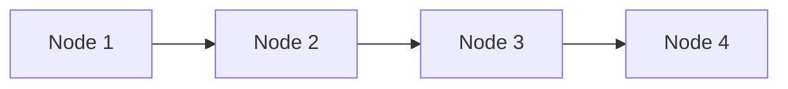
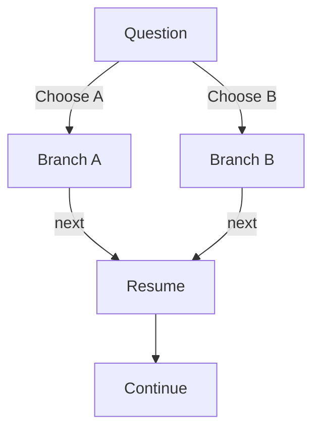
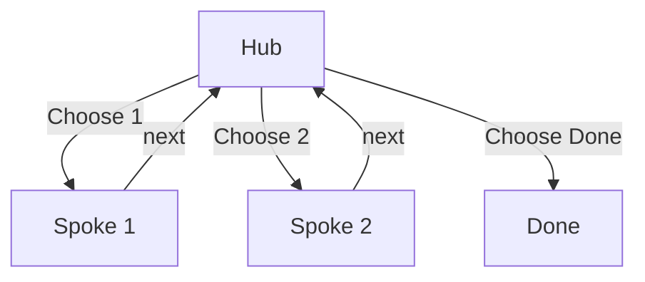
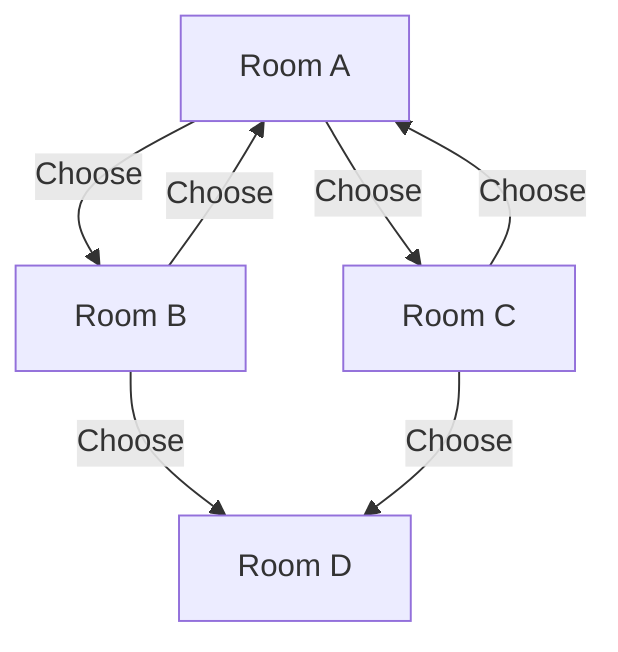

## Scope

This chapter defines how a conforming engine moves through a `Graph`.
Traversal behavior is normative.

## Engine State

At minimum, an engine maintains:

- `current`: the active node ID
- `history`: stack of previously visited node IDs
- `index`: mapping from node IDs to node positions

A node may include:

- `traversal.next` override
- `traversal.branch-point` with options

## Operation: Next

`Next` advances from the current node using deterministic precedence.

### Algorithm

1. Let `node` be the current node.
2. If `node.traversal.branch-point` exists, `Next` MUST NOT auto-advance.
   The engine remains at `node` until a valid `Choose` or `Back` operation.
3. If `node.traversal.next` exists:
   - validate target node ID
   - push `node.id` onto `history`
   - set `current` to `traversal.next`
   - return
4. Otherwise, resolve implicit sequence:
   - find the next node in array order (`nodes[i+1]`)
   - if present, push `node.id` to `history` and move there
   - if absent, the graph is complete and traversal ends

### Precedence

```text
branch-point gate -> traversal.next -> nodes[i+1] -> complete
```

## Operation: Choose

`Choose` selects an option at a branch point.

### Preconditions

- current node has `traversal.branch-point`
- selected key or option label maps to exactly one option

### Algorithm

1. Resolve selected option from presenter input.
2. Let `target` be option `target`.
3. Validate `target` exists.
4. Push current node ID to `history`.
5. Set `current` to `target`.

`Choose` is invalid outside a branch-point node.

## Operation: Goto

`Goto` jumps to any node ID explicitly requested by the presenter.

### Algorithm

1. Validate destination node ID exists.
2. Push current node ID to `history`.
3. Set `current` to destination node ID.

`Goto` bypasses branch-point gating because it is an explicit navigation command.

## Operation: Back

`Back` returns to the previous node from history.

### Algorithm

1. If `history` is empty, remain at current node.
2. Otherwise pop top ID from `history`.
3. Set `current` to popped node ID.

`Back` MUST NOT push a new history entry during the same operation.

## History Invariants

A conforming engine MUST satisfy all invariants:

1. `Choose` and `Goto` push exactly one history entry on success.
2. Successful `Next` pushes exactly one history entry when it moves.
3. `Back` pops one entry and pushes none.
4. Failed operations MUST NOT mutate history.
5. History entries are node IDs, not array indices.

## Branch-Point Rendering Rules

When current node has a branch point:

1. Render node content normally.
2. Render branch prompt and options.
3. Accept `Choose` and `Back`.
4. `Next` SHOULD either no-op or show branch selection guidance.

## Graph Patterns

These patterns are valid compositions of the same core traversal rules.

### Linear Sequence



Uses implicit `nodes[i+1]` progression.

### Branch and Rejoin



Implementation: branch options target branch nodes, and branch termini set
`traversal.next` to the same resume node.

### Hub and Spoke



Implementation: spoke nodes explicitly return to `Hub` via `traversal.next`.

### Open World



Implementation: dense branch-point graph with no required convergence.

## Error Handling

A conforming engine MUST reject or safely handle:

- unknown branch option target IDs
- unknown `traversal.next` target IDs
- duplicate node IDs
- malformed branch-point options

Recommended behavior is fail-fast validation before presentation starts.

## Conformance Checklist

An engine conforms to traversal semantics when it:

- implements `Next`, `Choose`, `Goto`, `Back`
- enforces branch-point gating for implicit `Next`
- resolves `traversal.next` before implicit sequence
- preserves history invariants
- validates node targets before navigation
