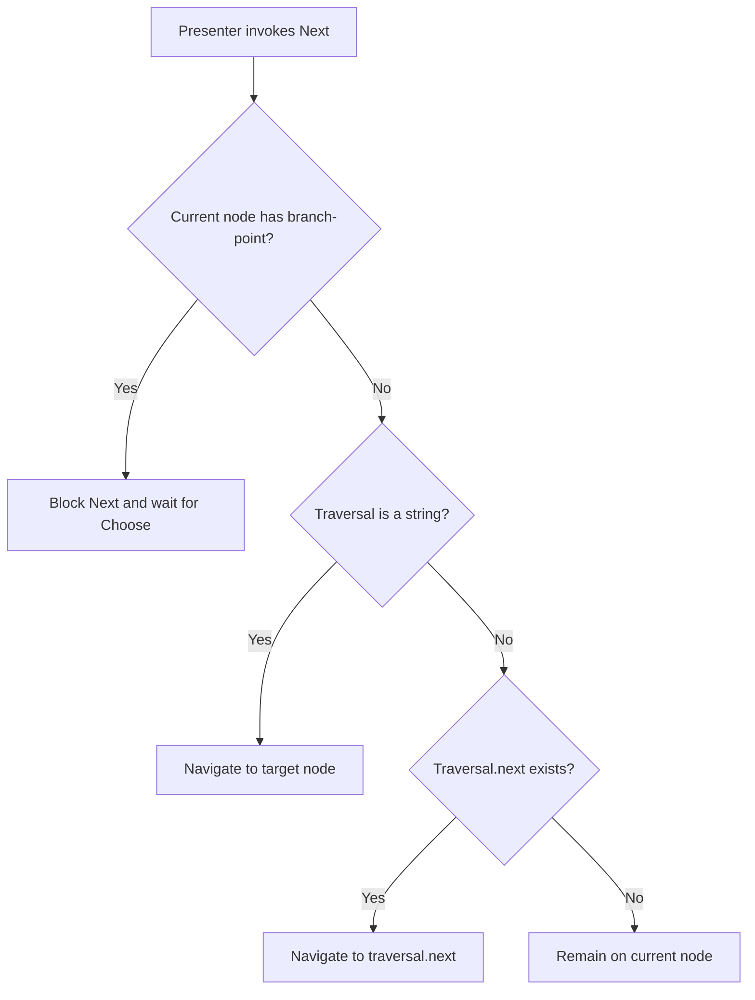
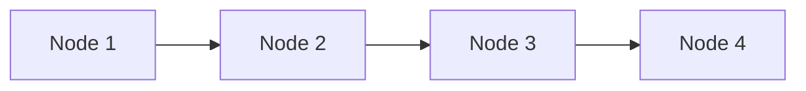
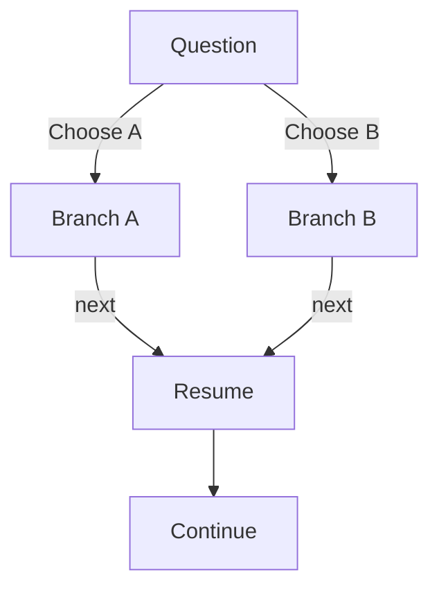
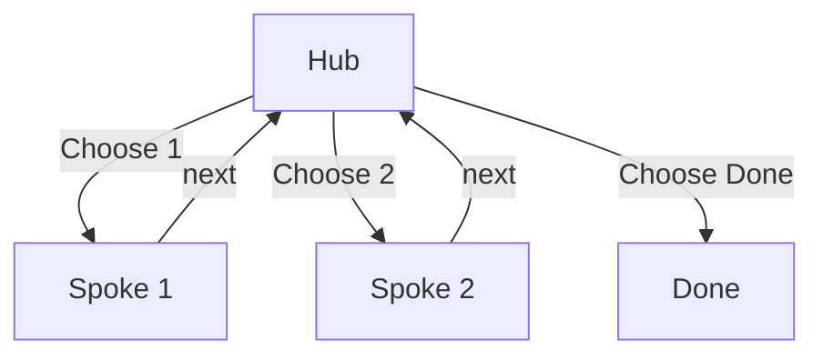
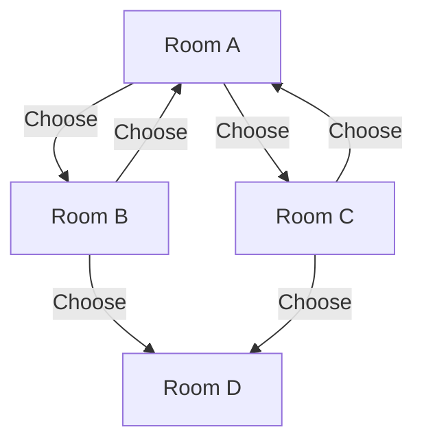

## Scope

This chapter defines how a conforming engine moves through a `Graph`.
Traversal behavior is normative.

The key idea is that traversal is always explicit. A presenter does not move to
“whatever comes next in the file.” Each move either follows a declared edge,
selects an option, jumps by node ID, or returns through history.

## Engine State

At minimum, an engine maintains:

- `current`: the active node ID
- `history`: stack of previously visited node IDs
- `index`: mapping from node IDs to nodes

A node may include either:

- a string `traversal` shorthand for a simple next edge
- a `Traversal` object with `next` or `branch-point`
- no traversal field, which means terminal

There is no implicit sequential fallback. Array order is only document
organization.

## Branch-point precedence

If a node has a branch point, `Next` is blocked. The engine MUST wait
for `Choose`.


```mermaid
flowchart TD
  A[Presenter invokes Next] --> B{Current node has branch-point?}
  B -->|Yes| C[Block Next and wait for Choose]
  B -->|No| D{Traversal is a string?}
  D -->|Yes| E[Navigate to target node]
  D -->|No| F{Traversal.next exists?}
  F -->|Yes| G[Navigate to traversal.next]
  F -->|No| H[Remain on current node]
```

## Operation: Next

`Next` advances from the current node using explicit traversal.

### Algorithm

1. Let `node` be the current node.
2. If `node.traversal.branch-point` exists, `Next` is invalid.
3. If `node.traversal` is a string:
   - validate target node ID
   - push `node.id` onto `history`
   - set `current` to the target
   - return
4. If `node.traversal.next` exists:
   - validate target node ID
   - push `node.id` onto `history`
   - set `current` to `traversal.next`
   - return
5. Otherwise, remain on the current node.

## Operation: Choose

`Choose` selects an option at a branch point.

The operation is only valid when the current node presents a `BranchPoint`.
Outside that case, engines should treat it as an invalid command.

### Preconditions

- current node has `traversal.branch-point`
- selected key or option label maps to exactly one option

### Algorithm

1. Resolve selected option from presenter input.
2. Let `target` be option `target`.
3. Validate `target` exists.
4. Push current node ID to `history`.
5. Set `current` to `target`.

`Choose` is invalid outside a branch-point node.

## Operation: Goto

`Goto` jumps to any node ID explicitly requested by the presenter.

Because `Goto` is an explicit command, it bypasses branch-point gating.

### Algorithm

1. Validate destination node ID exists.
2. Push current node ID to `history`.
3. Set `current` to destination node ID.

## Operation: Back

`Back` returns to the previous node from history.

### Algorithm

1. If `history` is empty, remain at current node.
2. Otherwise pop top ID from `history`.
3. Set `current` to popped node ID.

`Back` MUST NOT push a new history entry during the same operation.

## History Invariants

A conforming engine MUST satisfy all invariants:

1. `Choose` and `Goto` push exactly one history entry on success.
2. Successful `Next` pushes exactly one history entry when it moves.
3. `Back` pops one entry and pushes none.
4. Failed operations MUST NOT mutate history.
5. History entries are node IDs, not array indices.

These invariants are what keep traversal understandable after branching and
rejoining. They ensure that `Back` reflects the presenter’s actual path through
the graph, not a recomputed approximation.

## Branch return wiring

When a branch path should rejoin the main flow, the branch endpoint
sets its own explicit `traversal` target.

```json
{
  "id": "branch-end",
  "traversal": "rejoin",
  "content": []
}
```

Each endpoint wires its own return. That keeps nested branches, shared
nodes, and cycles explicit.

## Graph Patterns

These patterns are valid compositions of the same core traversal rules.

### Linear Sequence


```mermaid
graph LR
  A[Node 1] --> B[Node 2] --> C[Node 3] --> D[Node 4]
```

Uses explicit next edges.

### Branch and Rejoin


```mermaid
graph TD
  Q[Question] -->|Choose A| A[Branch A]
  Q -->|Choose B| B[Branch B]
  A -->|next| R[Resume]
  B -->|next| R
  R --> N[Continue]
```

Implementation: branch options target branch nodes, and branch termini
set `traversal.next` to the same resume node.

### Hub and Spoke


```mermaid
graph TD
  H[Hub] -->|Choose 1| S1[Spoke 1]
  H -->|Choose 2| S2[Spoke 2]
  H -->|Choose Done| D[Done]
  S1 -->|next| H
  S2 -->|next| H
```

Implementation: spoke nodes explicitly return to `Hub` via `traversal.next`.

### Open World


```mermaid
graph TD
  A[Room A] -->|Choose| B[Room B]
  A -->|Choose| C[Room C]
  B -->|Choose| A
  B -->|Choose| D[Room D]
  C -->|Choose| A
  C -->|Choose| D
```

Implementation: dense branch-point graph with no required convergence.

## Error Handling

A conforming engine MUST reject or safely handle:

- unknown branch option target IDs
- unknown `traversal.next` target IDs
- duplicate node IDs
- malformed branch-point options
- invalid `next` on a node with a branch point

Recommended behavior is fail-fast validation before presentation starts.

## Conformance Checklist

An engine conforms to traversal semantics when it:

- implements `Next`, `Choose`, `Goto`, `Back`
- enforces branch-point gating for implicit `Next`
- resolves explicit traversal before any terminal no-op
- preserves history invariants
- validates node targets before navigation
