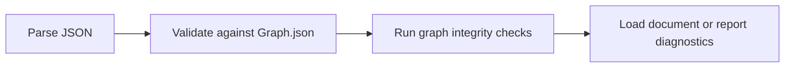

Validation has two layers: schema validation and semantic checks. The first
checks whether the document has the right shape. The second checks whether the
graph actually makes sense as a Fireside document.

## Layer 1: Schema Validation

A conforming document MUST validate against the generated `Graph.json`
schema (JSON Schema 2020-12).

At this layer, validation is structural. It does not ask whether a traversal
target is sensible in context; it asks whether the JSON matches the declared
shape of the protocol.

Schema validation enforces:

- required properties
- primitive, object, and array types
- enum value constraints
- `minItems` and scalar constraints
- discriminated content block structure
- traversal union shape

## Layer 2: Semantic Checks

After schema validation, tools SHOULD validate semantic integrity.

This second layer is where graph-specific errors become visible. A document can
be structurally valid JSON and still be unusable because it points to missing
nodes or declares contradictory traversal rules.

### Required Checks

1. Node IDs are unique.
2. All traversal targets reference existing Node IDs.
3. `branch-point.options` contains at least one option.
4. A `Traversal` object MUST NOT contain both `next` and `branch-point`.
5. Branch option `key` values MUST be unique within a single branch point.

### Recommended Checks

- Unreachable node detection from entry node.
- Self-loop warnings for authoring diagnostics.
- Duplicate labels or confusing branch prompts.
- Cycles that are likely accidental.
- Empty nodes that may need a content block.
- A `Traversal` object present but setting neither `next` nor
  `branch-point` (`{}`). The engine still treats this as terminal — the
  same as an absent `traversal` field — but it is flagged since an empty
  object is a more plausible authoring mistake than a deliberately omitted
  field.
- A content block's `reveal` value lower than its enclosing container's
  (`reveal-masked-by-container`) — the block can never actually appear
  before its container does, so the lower value is misleading rather than
  functional.
- An `ascii-art` block's widest line exceeding a practical presentation
  width (`ascii-art-too-wide`; the reference implementation uses 76
  columns) or with no art content at all (`ascii-art-empty`).
- A branch option `key` colliding with a presenter's reserved global
  single-key commands (`reserved-branch-key`; the reference implementation
  reserves `e f g h j k m n p q s t` for quit, help, map, quick-edit,
  notes, timer, and flow navigation) — the option can never be selected by
  keyboard, since the global action always wins.

## ContentBlock Validation Rules

### Core Blocks

Core kinds (`heading`, `text`, `code`, `list`, `image`, `divider`,
`container`, `ascii-art`) MUST validate against their specific block
schemas.

## Error Severity Guidance

| Severity | Meaning                                        | Engine Behavior        |
| -------- | ---------------------------------------------- | ---------------------- |
| Error    | Document is invalid and unsafe to present.     | Reject load.           |
| Warning  | Document is valid but potentially problematic. | Load with diagnostics. |
| Info     | Optional best-practice feedback.               | Surface in logs.       |

## Failure Handling

Good validation is only partly about rejecting bad documents. It is also about
making failures easy to fix.

- Parse failures: return explicit location and parser message.
- Schema failures: return failing path and rule.
- Integrity failures: identify source node and unresolved target.

Engines SHOULD favor clear, actionable diagnostics over generic failure output.
