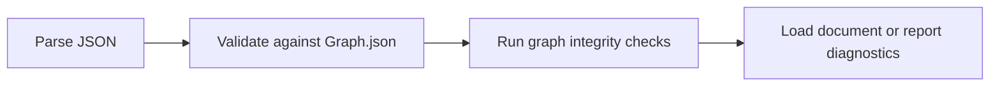

Validation has two layers: schema validation and semantic checks. The first
checks whether the document has the right shape. The second checks whether the
graph actually makes sense as a Fireside document.

## Layer 1: Schema Validation

A conforming document MUST validate against the generated `Graph.json`
schema (JSON Schema 2020-12).

At this layer, validation is structural. It does not ask whether a traversal
target is sensible in context; it asks whether the JSON matches the declared
shape of the protocol.

Schema validation enforces:

- required properties
- primitive, object, and array types
- enum value constraints
- `minItems` and scalar constraints
- discriminated content block structure
- traversal union shape

## Layer 2: Semantic Checks

After schema validation, tools SHOULD validate semantic integrity.

This second layer is where graph-specific errors become visible. A document can
be structurally valid JSON and still be unusable because it points to missing
nodes or declares contradictory traversal rules.

### Required Checks

1. Node IDs are unique.
2. All traversal targets reference existing Node IDs.
3. `branch-point.options` contains at least one option.
4. A `Traversal` object MUST NOT contain both `next` and `branch-point`.

### Recommended Checks

- Unreachable node detection from entry node.
- Branch option `key` values that collide within one branch point.
- Self-loop warnings for authoring diagnostics.
- Duplicate labels or confusing branch prompts.
- Cycles that are likely accidental.
- Empty nodes that may need a content block.

## ContentBlock Validation Rules

### Core Blocks

Core kinds (`heading`, `text`, `code`, `list`, `image`, `divider`,
`container`) MUST validate against their specific block schemas.

## Error Severity Guidance

| Severity | Meaning                                        | Engine Behavior        |
| -------- | ---------------------------------------------- | ---------------------- |
| Error    | Document is invalid and unsafe to present.     | Reject load.           |
| Warning  | Document is valid but potentially problematic. | Load with diagnostics. |
| Info     | Optional best-practice feedback.               | Surface in logs.       |

## Failure Handling

Good validation is only partly about rejecting bad documents. It is also about
making failures easy to fix.

- Parse failures: return explicit location and parser message.
- Schema failures: return failing path and rule.
- Integrity failures: identify source node and unresolved target.

Engines SHOULD favor clear, actionable diagnostics over generic failure output.
