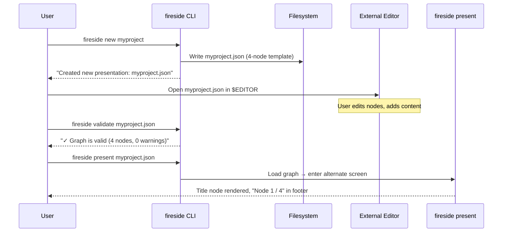
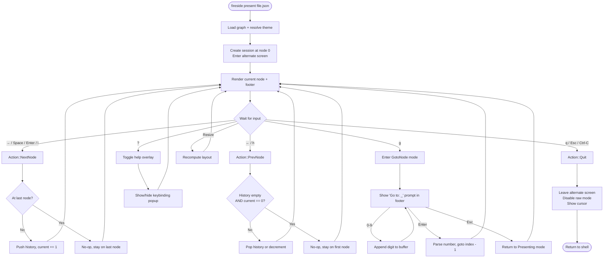
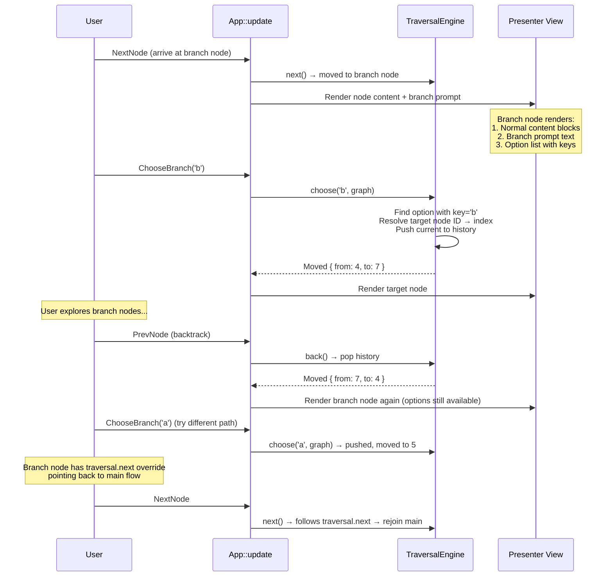
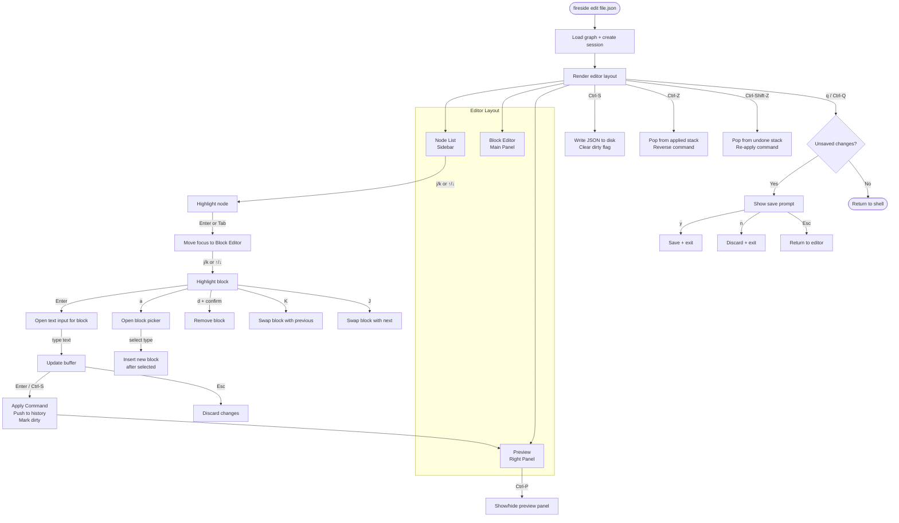
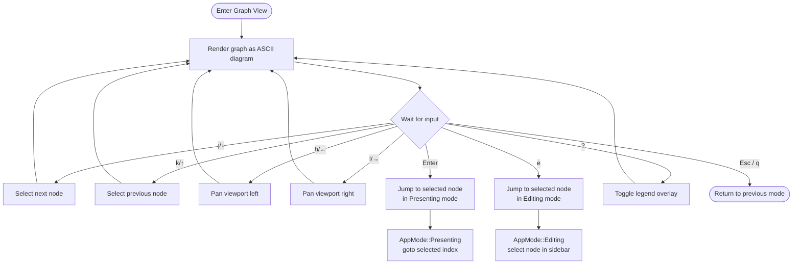
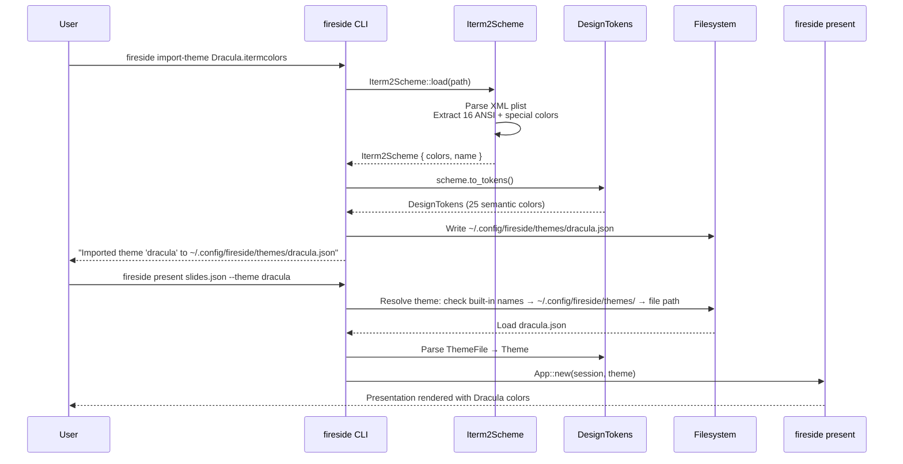
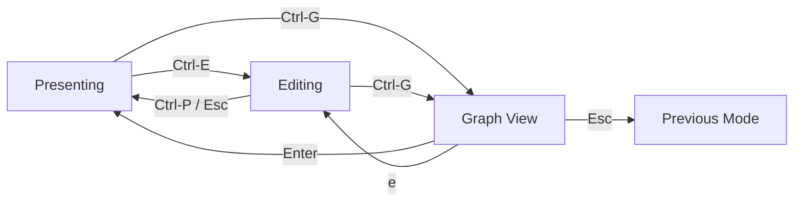

# Fireside TUI — User Experience Flows

This document specifies the 6 key user journeys for the Fireside TUI.
Each flow is detailed enough to serve as a build specification for
developers implementing the features.

## Architecture Context

All flows operate within the TEA (The Elm Architecture) pattern:

```
crossterm::Event → Action (enum) → App::update(&mut self, action) → App::view(frame)
```

State mutation happens **only** in `App::update`. Rendering is stateless.
The `AppMode` enum determines which keybindings and UI are active.

```
AppMode::Presenting  — normal navigation
AppMode::GotoNode    — number input for jump
AppMode::Editing     — node editor (proposed)
AppMode::GraphView   — graph explorer (proposed)
AppMode::Quitting    — teardown in progress
```

---

## Flow 1: First-Run Experience

**Goal:** A new user goes from zero to presenting their first graph.

### Trigger

The user runs `fireside new myproject` in their terminal (or
`fireside new myproject --project` for a full project directory).

### Step-by-Step Sequence



#### 1.1 Scaffolding (`fireside new`)

| Step | What Happens                                                                                             | Output                                     |
| ---- | -------------------------------------------------------------------------------------------------------- | ------------------------------------------ |
| 1    | CLI parses `name` argument                                                                               | —                                          |
| 2    | Check if `myproject.json` already exists                                                                 | Bail with error if so                      |
| 3    | Generate template JSON with `$schema` URL, today's date, 4 starter nodes (title, bullets, code, closing) | —                                          |
| 4    | Write file with `serde_json::to_string_pretty`                                                           | `Created new presentation: myproject.json` |

The generated file includes a `$schema` field pointing to the Graph JSON Schema,
enabling autocompletion in VS Code, Zed, and other JSON-Schema-aware editors.

**Project variant** (`fireside new myproject --project`):

| Step | What Happens                                                      | Output                            |
| ---- | ----------------------------------------------------------------- | --------------------------------- |
| 1    | Create `myproject/` directory                                     | —                                 |
| 2    | Write `myproject/fireside.json` with `nodes: ["nodes/main.json"]` | —                                 |
| 3    | Create `myproject/nodes/` and `myproject/themes/` directories     | —                                 |
| 4    | Scaffold `myproject/nodes/main.json` (same 4-node template)       | `Created new project: myproject/` |

#### 1.2 Editing (External Editor)

The user opens the JSON file in their preferred editor. Schema-aware
editors provide autocompletion for:

- Node fields: `id`, `layout`, `transition`, `speaker-notes`, `traversal`, `content`
- Content block `kind` values: `heading`, `text`, `code`, `list`, `image`, `divider`, `container`, `extension`
- Layout enum values: `default`, `center`, `top`, `title`, `fullscreen`, `blank`, `split-horizontal`, `split-vertical`, `align-left`, `align-right`, `code-focus`
- Transition enum values: `none`, `fade`, `slide-left`, `slide-right`, `slide-up`, `slide-down`, `dissolve`, `wipe`

#### 1.3 Validation (`fireside validate`)

| Step | What Happens                                                                                  | Output                                            |
| ---- | --------------------------------------------------------------------------------------------- | ------------------------------------------------- |
| 1    | Load and deserialize the JSON graph                                                           | Error on malformed JSON                           |
| 2    | Build node index, check for duplicate IDs                                                     | Error on duplicates                               |
| 3    | Run `validate_graph()` — check dangling references, unreachable nodes, branch target validity | —                                                 |
| 4    | Print diagnostics grouped by severity                                                         | `✓ Graph is valid` or list of Error/Warning items |

#### 1.4 First Presentation (`fireside present`)

| Step | What Happens                                                            | Output                   |
| ---- | ----------------------------------------------------------------------- | ------------------------ |
| 1    | Load graph, resolve theme (CLI `--theme` > doc `theme` > default)       | —                        |
| 2    | Create `PresentationSession::new(graph, 0)`                             | —                        |
| 3    | Enable raw mode, enter alternate screen                                 | Terminal switches to TUI |
| 4    | Render first node centered, footer shows `Node 1 / N`, timer at `00:00` | —                        |
| 5    | User navigates with → / ← / l / h                                       | See Flow 2               |
| 6    | `q` or `Esc` → restore terminal                                         | Back to shell prompt     |

### Edge Cases

| Scenario                | Behavior                                                           |
| ----------------------- | ------------------------------------------------------------------ |
| Name already exists     | `"File already exists: myproject.json"` — bail, no overwrite       |
| Invalid JSON on present | `"loading graph: expected value at line 5 column 3"`               |
| Empty nodes array       | Validation error: `"graph contains no nodes"`                      |
| No `$schema` field      | Works fine; schema is optional, autocompletion just won't activate |
| Non-UTF-8 file          | Deserialize error from serde                                       |

---

## Flow 2: Linear Presentation

**Goal:** Present a straight-line graph, navigating forward and backward
through nodes with progress tracking and elapsed time.

### Trigger

```
fireside present slides.json
fireside present slides.json --theme dracula
fireside present slides.json --start 3
```

Or via project:

```
fireside open myproject/
```

### Step-by-Step Sequence



### Keyboard Shortcuts (Presenting Mode)

| Key      | Action          | Description                                               |
| -------- | --------------- | --------------------------------------------------------- |
| `→`      | `NextNode`      | Advance to next node (respects `traversal.next` override) |
| `Space`  | `NextNode`      | Same as →                                                 |
| `Enter`  | `NextNode`      | Same as →                                                 |
| `l`      | `NextNode`      | Vim-style forward                                         |
| `←`      | `PrevNode`      | Go back (pops history stack, or sequential fallback)      |
| `h`      | `PrevNode`      | Vim-style back                                            |
| `g`      | `EnterGotoMode` | Switch to GotoNode mode                                   |
| `?`      | `ToggleHelp`    | Show/hide keybinding overlay                              |
| `q`      | `Quit`          | Exit presentation                                         |
| `Esc`    | `Quit`          | Exit presentation                                         |
| `Ctrl-C` | `Quit`          | Exit presentation                                         |

### Keyboard Shortcuts (GotoNode Mode)

| Key     | Action         | Description                                                |
| ------- | -------------- | ---------------------------------------------------------- |
| `0`-`9` | `GotoDigit(n)` | Append digit to go-to buffer                               |
| `Enter` | `GotoConfirm`  | Jump to node number (1-indexed input → 0-indexed internal) |
| `Esc`   | `GotoCancel`   | Cancel and return to Presenting mode                       |

### Mouse Interactions (Proposed)

| Gesture             | Action          | Description                    |
| ------------------- | --------------- | ------------------------------ |
| Scroll down         | `NextNode`      | Advance to next node           |
| Scroll up           | `PrevNode`      | Go back to previous node       |
| Click progress bar  | `EnterGotoMode` | Open go-to input on the footer |
| Click help `?` icon | `ToggleHelp`    | Toggle keybinding overlay      |

### Visual Feedback

| Element       | Content                                | Location                             |
| ------------- | -------------------------------------- | ------------------------------------ |
| Progress bar  | `Node 3 / 12` (bold)                   | Footer left                          |
| Elapsed timer | `05:23`                                | Footer right                         |
| Layout        | Applied per-node via `compute_areas()` | Content area                         |
| Help overlay  | Centered popup with keybinding table   | Center, on top of content            |
| Go-to prompt  | `Go to node: 12_`                      | Replaces footer during GotoNode mode |

### Edge Cases

| Scenario                            | Behavior                                                                                          |
| ----------------------------------- | ------------------------------------------------------------------------------------------------- |
| At last node, press →               | `TraversalResult::AtBoundary` — no movement, stay on last node                                    |
| At first node, press ←              | `TraversalResult::AtBoundary` — no movement, stay on first node                                   |
| Go-to with number 0                 | `saturating_sub(1)` → clamps to node 0                                                            |
| Go-to with number > total           | `EngineError::InvalidTraversal` — `goto()` returns error, mode returns to Presenting, no movement |
| Go-to with empty buffer + Enter     | `parse::<usize>` fails — mode returns to Presenting, no movement                                  |
| Node has `traversal.next` override  | `next()` follows the override instead of sequential advance                                       |
| Terminal resize during presentation | `Event::Resize(w, h)` triggers re-render with new dimensions                                      |
| Single-node graph                   | Navigation has no effect; progress shows `Node 1 / 1`                                             |

### Exit Points

| Exit Method            | What Happens                                                          |
| ---------------------- | --------------------------------------------------------------------- |
| `q` / `Esc` / `Ctrl-C` | `AppMode::Quitting` → leave alternate screen → restore cursor → shell |
| Reach last node + `q`  | Same as above (no auto-exit at end)                                   |

---

## Flow 3: Branching Presentation

**Goal:** Navigate a graph with branch points — see options, choose a
path, explore a branch, backtrack, and rejoin the main flow.

### Trigger

User navigates to a node that has a `traversal.branch-point` defined.
This happens automatically during linear navigation (Flow 2).

### Step-by-Step Sequence



### Branch Node Rendering

When the current node has a `traversal.branch-point`, the presenter
renders additional UI below the content blocks:

```
┌─────────────────────────────────────────────────┐
│                                                 │
│  ## Choose Your Path                            │
│                                                 │
│  Fireside supports branching presentations      │
│  with traversal overrides.                      │
│                                                 │
│  ─────────────────────────────────────────────   │
│                                                 │
│  What would you like to explore?                │
│                                                 │
│   [a] Themes & Colors                          │
│   [b] Content Blocks                           │
│   [c] Skip to end                              │
│                                                 │
│                                                 │
│ Node 5 / 8                              02:15   │
└─────────────────────────────────────────────────┘
```

The branch prompt and options are rendered as additional content below the
node's content blocks. Each option shows its key in brackets, styled with
the `accent` design token color.

### Keyboard Shortcuts (Branch-Specific)

| Key | Action              | Condition                                         | Description                                                              |
| --- | ------------------- | ------------------------------------------------- | ------------------------------------------------------------------------ |
| `a` | `ChooseBranch('a')` | Current node has branch point with option key `a` | Select first option                                                      |
| `b` | `ChooseBranch('b')` | Current node has branch point with option key `b` | Select second option                                                     |
| `c` | `ChooseBranch('c')` | Current node has branch point with option key `c` | Select third option                                                      |
| `d` | `ChooseBranch('d')` | Current node has branch point with option key `d` | Select fourth option                                                     |
| `e` | `ChooseBranch('e')` | Current node has branch point with option key `e` | Select fifth option                                                      |
| `f` | `ChooseBranch('f')` | Current node has branch point with option key `f` | Select sixth option                                                      |
| `→` | `NextNode`          | Always                                            | If at branch, sequential advance (ignores branch); use for "skip branch" |
| `←` | `PrevNode`          | Always                                            | Pop history — returns to wherever user came from                         |

All other Presenting mode keys remain active (go-to, help, quit).

### Mouse Interactions (Proposed)

| Gesture                                  | Action                               | Description                      |
| ---------------------------------------- | ------------------------------------ | -------------------------------- |
| Click option label `[a] Themes & Colors` | `ChooseBranch('a')`                  | Select branch option by clicking |
| Hover option                             | Highlight with `primary` token color | Visual feedback                  |

### Backtracking Behavior

The history stack enables full backtracking through branch choices:

```
History: [0, 1, 2, 3, 4]    (linear navigation to branch node 4)
Choose 'b' → target node 7:  [0, 1, 2, 3, 4, 4]   (4 pushed again)
Navigate node 7 → 8:         [0, 1, 2, 3, 4, 4, 7]
Back:                         [0, 1, 2, 3, 4, 4]    → returns to node 7
Back:                         [0, 1, 2, 3, 4]       → returns to node 4 (branch node)
Choose 'a' → target node 5:  [0, 1, 2, 3, 4, 4]    (new choice from same point)
```

Branch nodes with `traversal.next` overrides allow branches to rejoin the
main flow. When the user reaches the end of a branch and presses →, the
engine follows the `traversal.next` pointer back to the main sequence.

### Edge Cases

| Scenario                            | Behavior                                                                                           |
| ----------------------------------- | -------------------------------------------------------------------------------------------------- |
| Press `a`-`f` on non-branch node    | `EngineError::InvalidTraversal("current node has no branch point")` — no-op, ignored               |
| Press key not matching any option   | `EngineError::InvalidTraversal("no branch option with key 'x'")` — no-op                           |
| Branch target node ID doesn't exist | `EngineError::DanglingReference` — validated at load time; at runtime, error is caught and ignored |
| Branch with single option           | Renders normally with just one `[a]` option                                                        |
| Branch with 6 options (max)         | All `a`-`f` options rendered; current limit is 6                                                   |
| Deeply nested branches              | History stack grows unbounded; each choice pushes to stack                                         |
| Branch node at end of graph         | Options still work; → has no sequential next to advance to                                         |
| Circular traversal.next references  | Engine follows the pointer; no cycle detection at runtime (validated at load)                      |

### Exit Points

Same as Flow 2 — `q` / `Esc` / `Ctrl-C` exits from any point, including
mid-branch navigation.

---

## Flow 4: Editing (Proposed)

**Goal:** Open the TUI editor to browse nodes, edit content blocks, add or
remove blocks, reorder them, and preview changes in real time.

> **Implementation status:** `run_editor()` is stubbed.
> `Command` types and `CommandHistory` scaffold exist in `fireside-engine`.
> This flow defines the complete editing UX for implementation.

### Trigger

```
fireside edit myproject.json
fireside edit myproject/
```

### Proposed AppMode Additions

```rust
enum AppMode {
    // ... existing modes ...
    Editing {
        /// Which panel has focus.
        focus: EditFocus,
    },
}

enum EditFocus {
    /// Node list sidebar.
    NodeList,
    /// Content block editor.
    BlockEditor {
        /// Index of the selected block within the current node.
        selected_block: usize,
    },
    /// Block-type picker overlay.
    BlockPicker,
    /// Text input for editing a block field.
    TextInput {
        field: EditField,
        buffer: String,
        cursor: usize,
    },
}
```

### Proposed Action Additions

```rust
enum Action {
    // ... existing actions ...
    EnterEditMode,
    ExitEditMode,
    SelectNode(usize),
    SelectBlock(usize),
    MoveBlockUp,
    MoveBlockDown,
    AddBlock,
    DeleteBlock,
    EditBlockField(EditField),
    ConfirmEdit,
    CancelEdit,
    Undo,
    Redo,
    Save,
    PreviewToggle,
}
```

### Step-by-Step Sequence



### Editor Layout

```
┌──────────────┬──────────────────────────┬──────────────────┐
│  Nodes       │  Content Blocks          │  Preview         │
│              │                          │                  │
│ ● title      │  [1] heading  H1         │  ┌────────────┐  │
│   what-is    │      "Hello, Fireside!"  │  │  Hello,     │  │
│   code-demo  │                          │  │  Fireside!  │  │
│   layouts    │  [2] text                │  │             │  │
│   branch-demo│      "A portable format" │  │  A portable │  │
│   themes     │                          │  │  format...  │  │
│   blocks     │  [3] text                │  │             │  │
│   thanks     │      "Press → to advance"│  │  Press →    │  │
│              │                          │  └────────────┘  │
│              │                          │                  │
│              │  [a]dd  [d]elete  [J/K]  │                  │
│──────────────│──────────────────────────│──────────────────│
│ ● modified   │  title [H1 center]       │  Ctrl-S: Save    │
└──────────────┴──────────────────────────┴──────────────────┘
```

Three-panel layout using `ratatui::Layout`:

- **Left (20%):** Node list with selection indicator (●), node IDs or auto-generated labels
- **Center (45%):** Block list with numbered blocks, inline field summary, toolbar hints
- **Right (35%):** Live preview of the selected node rendered as it would appear in present mode

### Keyboard Shortcuts (Editing Mode)

#### Node List Focus

| Key             | Action                          | Description                              |
| --------------- | ------------------------------- | ---------------------------------------- |
| `j` / `↓`       | Select next node                | Move selection down                      |
| `k` / `↑`       | Select previous node            | Move selection up                        |
| `Enter` / `Tab` | Switch focus to Block Editor    | Begin editing the selected node's blocks |
| `A`             | Add node after selected         | Insert new node, prompt for ID           |
| `D`             | Delete node (with confirmation) | Remove node from graph                   |
| `Esc`           | No-op (already at top level)    | —                                        |

#### Block Editor Focus

| Key             | Action                    | Description                       |
| --------------- | ------------------------- | --------------------------------- |
| `j` / `↓`       | Select next block         | Move block selection down         |
| `k` / `↑`       | Select previous block     | Move block selection up           |
| `Enter`         | Edit selected block       | Open text input for primary field |
| `a`             | Add block after selected  | Open block type picker            |
| `d`             | Delete selected block     | Remove with confirmation prompt   |
| `J` (`Shift-J`) | Move block down           | Swap with next block              |
| `K` (`Shift-K`) | Move block up             | Swap with previous block          |
| `Tab` / `Esc`   | Return focus to Node List | —                                 |
| `Ctrl-P`        | Toggle preview panel      | Show/hide right panel             |

#### Text Input Focus

| Key                | Action               | Description                                  |
| ------------------ | -------------------- | -------------------------------------------- |
| Any printable char | Insert at cursor     | Append to input buffer                       |
| `Backspace`        | Delete before cursor | Remove character                             |
| `←` / `→`          | Move cursor          | Navigate within buffer                       |
| `Enter`            | Confirm edit         | Apply change as a `Command`, push to history |
| `Esc`              | Cancel edit          | Discard buffer, return to Block Editor       |

#### Global (Any Focus)

| Key                                     | Action | Description                                              |
| --------------------------------------- | ------ | -------------------------------------------------------- |
| `Ctrl-S`                                | Save   | Serialize graph to JSON, write to disk, clear dirty flag |
| `Ctrl-Z`                                | Undo   | Pop last command from applied stack, reverse it          |
| `Ctrl-Shift-Z` / `Ctrl-Y`               | Redo   | Pop from undone stack, re-apply                          |
| `Ctrl-Q` / `q` (when not in text input) | Quit   | Check dirty flag → prompt if unsaved                     |

### Block Type Picker

When the user presses `a` to add a block, a centered overlay lists
available block types:

```
┌─ Add Block ─────────────────────┐
│                                 │
│  [1] heading   Heading (H1-H6) │
│  [2] text      Prose text      │
│  [3] code      Source code     │
│  [4] list      Bullet/numbered │
│  [5] image     Image + caption │
│  [6] divider   Horizontal rule │
│  [7] container Nested blocks   │
│                                 │
│  Press 1-7 or Esc to cancel    │
└─────────────────────────────────┘
```

### Command Flow

Every edit produces a `Command` that flows through `CommandHistory`:

1. User edits a heading's text from "Hello" to "Welcome"
2. System creates `Command::UpdateNodeContent { node_id, content }` with the old content saved for undo
3. `CommandHistory::push(command)` — clears redo stack
4. `session.mark_dirty()` — enables save prompt on quit
5. Preview panel re-renders the node

### Mouse Interactions (Proposed)

| Gesture               | Action       | Description                |
| --------------------- | ------------ | -------------------------- |
| Click node in sidebar | Select node  | Switch to clicked node     |
| Click block in editor | Select block | Highlight clicked block    |
| Double-click block    | Edit block   | Open text input            |
| Click `[a]dd` toolbar | Add block    | Open block picker          |
| Drag block handle     | Reorder      | Move block up/down in list |

### Edge Cases

| Scenario                                 | Behavior                                                                               |
| ---------------------------------------- | -------------------------------------------------------------------------------------- |
| Edit node with zero blocks               | Block Editor shows "No content blocks. Press [a] to add."                              |
| Delete last block in node                | Node becomes empty; warning shown but allowed                                          |
| Delete node referenced by traversal.next | Warning: "Node 'X' is referenced by node 'Y' traversal.next" — allow with confirmation |
| Delete node referenced by branch option  | Warning: "Node 'X' is a branch target" — allow with confirmation                       |
| Undo with empty history                  | No-op; `can_undo()` returns false                                                      |
| Redo after new edit                      | Redo stack cleared on new command push                                                 |
| Save with validation errors              | Save proceeds (file is valid JSON); diagnostics shown as warnings                      |
| Quit with unsaved changes                | Prompt: "Unsaved changes. [y]Save [n]Discard [Esc]Cancel"                              |
| File write failure (permissions)         | Error shown in status bar; dirty flag remains set                                      |

### Exit Points

| Exit Method                   | What Happens             |
| ----------------------------- | ------------------------ |
| `Ctrl-Q` with no changes      | Immediate exit           |
| `Ctrl-Q` with unsaved changes | Save confirmation prompt |
| `Ctrl-S` then `Ctrl-Q`        | Save, then exit          |

---

## Flow 5: Graph Exploration (Proposed)

**Goal:** Visualize the graph structure, see relationships between nodes
(sequential, branch targets, traversal overrides), and jump to any node
in the presenter or editor.

> **Implementation status:** Not started. This flow defines the complete
> graph exploration UX for implementation.

### Trigger

Proposed entry points:

| Entry                | How                                                                   |
| -------------------- | --------------------------------------------------------------------- |
| From Presenting mode | `Ctrl-G` — switch to graph view                                       |
| From Editing mode    | `Ctrl-G` — switch to graph view                                       |
| CLI                  | `fireside present file.json --graph` — start in graph view (proposed) |

### Proposed AppMode Addition

```rust
enum AppMode {
    // ... existing modes ...
    GraphView {
        /// Index of the highlighted node in the graph.
        selected: usize,
        /// Viewport offset for scrolling large graphs.
        scroll_offset: (i16, i16),
    },
}
```

### Step-by-Step Sequence



### Graph Rendering

The graph view renders nodes as boxes connected by arrows, using
box-drawing characters:

```
┌─ Graph: Hello, Fireside! ──────────────────────────────────────────────┐
│                                                                        │
│  ┌──────────┐    ┌──────────┐    ┌──────────┐    ┌──────────┐         │
│  │  title   │───→│ what-is  │───→│code-demo │───→│ layouts  │         │
│  │  (H1)    │    │  (list)  │    │  (code)  │    │(columns) │         │
│  └──────────┘    └──────────┘    └──────────┘    └──────────┘         │
│                                                       │                │
│                                                       ▼                │
│                                                  ┌──────────┐         │
│                                                  │●branch-  │         │
│                                                  │  demo    │         │
│                                                  └─┬──┬──┬──┘         │
│                                             a ╱    │  │  │   ╲ c      │
│                                              ╱   b │  │  │    ╲       │
│                                             ╱      │  │  │     ╲      │
│                                    ┌────────┐  ┌───┴──┐  ┌─────┴──┐  │
│                                    │ themes │  │blocks│  │ thanks │  │
│                                    └────┬───┘  └──┬───┘  │  (H1)  │  │
│                                         │         │      └────────┘  │
│                                         └────→────┘──────→──┘        │
│                                        (traversal.next overrides)    │
│                                                                        │
│  Legend: ───→ sequential  ─┬─ branch  ····→ traversal.next override   │
│          ● = current node  [sel] = selected                            │
│                                                                        │
│  Node 5 selected: branch-demo                  j/k: navigate  Enter: go│
└────────────────────────────────────────────────────────────────────────┘
```

### Visual Indicators

| Element                     | Style                               | Meaning                          |
| --------------------------- | ----------------------------------- | -------------------------------- |
| `●` before node name        | `primary` token color, bold         | Currently active node in session |
| `[sel]` highlight / inverse | `accent` token color, reversed      | Graph cursor (selected for jump) |
| Solid arrow `───→`          | `muted` token color                 | Sequential edge (next node)      |
| Branch lines `┬`            | `accent` token color                | Branch point edges               |
| Dotted arrow `····→`        | `heading_h3` token color            | Traversal.next override          |
| Node box border             | `border_inactive` / `border_active` | Default / selected node          |

### Keyboard Shortcuts (Graph View)

| Key         | Action                  | Description                                     |
| ----------- | ----------------------- | ----------------------------------------------- |
| `j` / `↓`   | Select next node        | Move selection down (by node index)             |
| `k` / `↑`   | Select previous node    | Move selection up (by node index)               |
| `h` / `←`   | Pan left                | Scroll viewport horizontally                    |
| `l` / `→`   | Pan right               | Scroll viewport horizontally                    |
| `H` / `L`   | Jump to first/last node | Quick navigation extremes                       |
| `Enter`     | Go to Presenting mode   | `goto(selected)` then `AppMode::Presenting`     |
| `e`         | Go to Editing mode      | `AppMode::Editing` with selected node focused   |
| `?`         | Toggle legend           | Show/hide the edge type legend                  |
| `f`         | Fit to screen           | Reset zoom/pan to show entire graph             |
| `Esc` / `q` | Exit graph view         | Return to previous mode (Presenting or Editing) |
| `Ctrl-G`    | Exit graph view         | Same as Esc                                     |

### Mouse Interactions (Proposed)

| Gesture           | Action            | Description                    |
| ----------------- | ----------------- | ------------------------------ |
| Click node        | Select node       | Move selection to clicked node |
| Double-click node | Jump to presenter | Goto node in Presenting mode   |
| Click + drag      | Pan viewport      | Scroll the graph view          |
| Scroll wheel      | Pan vertically    | Scroll up/down through graph   |

### Graph Layout Algorithm

For the ASCII graph rendering, use a simplified layered layout:

1. **Assign layers:** Nodes are placed in layers by their topological order (BFS from first node)
2. **Minimize crossings:** Within each layer, order nodes to reduce edge crossings
3. **Draw edges:** Use box-drawing characters for connections; branch edges fan out, override edges use dotted lines
4. **Viewport:** For graphs larger than the terminal, support scrolling with a viewport window

### Edge Cases

| Scenario                         | Behavior                                                                   |
| -------------------------------- | -------------------------------------------------------------------------- |
| Single-node graph                | Shows one box, no edges. Navigation has no effect.                         |
| Linear graph (no branches)       | Renders as horizontal chain of boxes                                       |
| Large graph (50+ nodes)          | Scrollable viewport; `f` to fit-to-screen may truncate labels              |
| Disconnected nodes (unreachable) | Rendered in a separate cluster below main graph, marked with warning color |
| Self-referencing traversal.next  | Loop arrow drawn on node                                                   |
| Node without ID                  | Displayed as `[1]`, `[2]`, etc. (index-based label)                        |

### Exit Points

| Exit Method                      | Destination                            |
| -------------------------------- | -------------------------------------- |
| `Esc` / `q` from presenter entry | Return to `AppMode::Presenting`        |
| `Esc` / `q` from editor entry    | Return to `AppMode::Editing`           |
| `Enter` on selected node         | `AppMode::Presenting` at selected node |
| `e` on selected node             | `AppMode::Editing` at selected node    |

---

## Flow 6: Theme Customization

**Goal:** Import an iTerm2 color scheme, preview it in the presenter,
apply it to a presentation, and manage saved themes.

### Trigger

```
fireside import-theme ~/Downloads/Dracula.itermcolors
fireside import-theme ~/Downloads/Dracula.itermcolors --name dracula
fireside present slides.json --theme dracula
fireside present slides.json --theme ~/my-theme.json
```

### Step-by-Step Sequence



### Theme Resolution Order

When resolving a `--theme` argument (or document `theme` field), the
engine checks in this order:

| Priority | Source                           | Example           |
| -------- | -------------------------------- | ----------------- |
| 1        | CLI `--theme` flag               | `--theme dracula` |
| 2        | Document `"theme"` field in JSON | `"theme": "nord"` |
| 3        | Default theme                    | Built-in colors   |

For the theme name itself:

| Priority | Location                                     | Example                                              |
| -------- | -------------------------------------------- | ---------------------------------------------------- |
| 1        | Built-in theme name                          | `default`                                            |
| 2        | `~/.config/fireside/themes/{name}.json`      | `dracula` → `~/.config/fireside/themes/dracula.json` |
| 3        | Direct file path (`.json` or `.itermcolors`) | `~/my-theme.json`                                    |

### iTerm2 → Design Token Mapping

| iTerm2 Key            | Design Token(s)            |
| --------------------- | -------------------------- |
| Background Color      | `background`               |
| Foreground Color      | `on_background`, `body`    |
| Bold Color            | `heading_h1`, `primary`    |
| Ansi 1 (Red)          | `error`                    |
| Ansi 2 (Green)        | `success`, `heading_h2`    |
| Ansi 3 (Yellow)       | `heading_h3`               |
| Ansi 4 (Blue)         | `accent`                   |
| Ansi 5 (Magenta)      | `accent` (fallback)        |
| Ansi 8 (Bright Black) | `muted`, `border_inactive` |
| Selection Color       | `surface`, `code_bg`       |
| Cursor Color          | `border_active`            |

### Generated JSON Format

```json
{
  "source": "Dracula.itermcolors",
  "background": "#282a36",
  "foreground": "#f8f8f2",
  "heading_h1": "#bd93f9",
  "heading_h2": "#50fa7b",
  "heading_h3": "#f1fa8c",
  "code_background": "#44475a",
  "code_foreground": "#f8f8f2",
  "code_border": "#6272a4",
  "block_quote": "#6272a4",
  "footer": "#6272a4"
}
```

### Theme Preview Workflow (Proposed)

For users who want to try themes before committing:

```bash
fireside present slides.json --theme ~/new-theme.itermcolors
```

This would:

1. Parse the `.itermcolors` file on the fly (without saving to `~/.config/fireside/themes/`)
2. Convert to `DesignTokens` → `Theme`
3. Start the presentation with the temporary theme
4. User sees their content with the new colors
5. If satisfied, they run `fireside import-theme` to save it permanently

### Keyboard Shortcuts (Proposed Theme Cycling — In-Presentation)

| Key               | Action                  | Description                                                |
| ----------------- | ----------------------- | ---------------------------------------------------------- |
| `T` (`Shift-T`)   | Cycle to next theme     | Cycle through saved themes in `~/.config/fireside/themes/` |
| `Shift-T` (again) | Cycle to previous theme | Reverse cycle                                              |

When cycling, the footer briefly shows the theme name:

```text
│ Node 3 / 12   Theme: dracula                             02:15 │
```

### Theme File Management

| Location                     | Purpose                                                 |
| ---------------------------- | ------------------------------------------------------- |
| `~/.config/fireside/themes/` | User's imported and custom themes                       |
| `<project>/themes/`          | Project-local themes (from `fireside new --project`)    |
| Built-in                     | Hardcoded `Theme::default()` with terminal reset colors |

### Edge Cases

| Scenario                             | Behavior                                                            |
| ------------------------------------ | ------------------------------------------------------------------- |
| `.itermcolors` missing expected keys | Missing colors fall back to defaults from `DesignTokens::default()` |
| Invalid XML plist                    | `Iterm2Error::Plist` — "failed to parse plist: ..."                 |
| Theme name collision on import       | Overwrites existing theme file (no prompt currently)                |
| `--theme` with nonexistent name      | Falls back to default theme (no error)                              |
| `Color::Reset` in theme              | Uses terminal's own default color — adapts to light/dark terminal   |
| Theme saved to unwritable path       | `anyhow` error: "writing theme file: Permission denied"             |
| No `$HOME` environment variable      | Falls back to `./themes/` relative path                             |
| `.itermcolors` with P3 color space   | Colors are parsed and converted to sRGB for terminal compatibility  |

### Exit Points

Theme import is a one-shot CLI command — it writes the file and returns
to the shell. Theme application happens within the presentation or editor
flows (Flows 2-5).

---

## Cross-Flow Navigation (Proposed)

Once all modes are implemented, mode switching uses these global keys:



### Mode Transition Table

| From       | To         | Key         | Description                                 |
| ---------- | ---------- | ----------- | ------------------------------------------- |
| Presenting | Editing    | `Ctrl-E`    | Open editor at current node                 |
| Presenting | Graph View | `Ctrl-G`    | Open graph view, current node highlighted   |
| Editing    | Presenting | `Ctrl-P`    | Present from currently selected node        |
| Editing    | Graph View | `Ctrl-G`    | Open graph view, current node highlighted   |
| Graph View | Presenting | `Enter`     | Jump to selected node in presenter          |
| Graph View | Editing    | `e`         | Jump to selected node in editor             |
| Graph View | Previous   | `Esc` / `q` | Return to whichever mode entered graph view |
| Any        | Quitting   | `Ctrl-Q`    | Exit (with save prompt if dirty)            |

### Shared State Across Modes

All modes share the same `PresentationSession`:

- **`session.graph`** — the graph data (mutated only via `Command` in editing)
- **`session.traversal`** — navigation state (current node, history stack)
- **`session.dirty`** — modification tracking (set by editor, cleared by save)

When switching modes, the current node index is preserved so the user
returns to the same place in the content.

---

## Summary: Complete Keyboard Reference

### Presenting Mode

| Key                           | Action                            |
| ----------------------------- | --------------------------------- |
| `→` / `Space` / `Enter` / `l` | Next node                         |
| `←` / `h`                     | Previous node                     |
| `g`                           | Go-to node mode                   |
| `a`-`f`                       | Choose branch option              |
| `?`                           | Toggle help                       |
| `q` / `Esc` / `Ctrl-C`        | Quit                              |
| `Ctrl-E`                      | Switch to editor _(proposed)_     |
| `Ctrl-G`                      | Switch to graph view _(proposed)_ |
| `T`                           | Cycle theme _(proposed)_          |

### GotoNode Mode

| Key     | Action       |
| ------- | ------------ |
| `0`-`9` | Enter digit  |
| `Enter` | Confirm jump |
| `Esc`   | Cancel       |

### Editing Mode _(Proposed)_

| Key                       | Context                | Action                  |
| ------------------------- | ---------------------- | ----------------------- |
| `j` / `↓`                 | Node list / Block list | Select next             |
| `k` / `↑`                 | Node list / Block list | Select previous         |
| `Enter`                   | Node list              | Focus block editor      |
| `Enter`                   | Block list             | Edit block field        |
| `Tab`                     | Node list              | Focus block editor      |
| `Tab` / `Esc`             | Block editor           | Return to node list     |
| `a`                       | Block editor           | Add block               |
| `d`                       | Block editor           | Delete block            |
| `J`                       | Block editor           | Move block down         |
| `K`                       | Block editor           | Move block up           |
| `Ctrl-P`                  | Any                    | Toggle preview          |
| `Ctrl-S`                  | Any                    | Save                    |
| `Ctrl-Z`                  | Any                    | Undo                    |
| `Ctrl-Shift-Z` / `Ctrl-Y` | Any                    | Redo                    |
| `Ctrl-Q`                  | Any                    | Quit (with save prompt) |
| `Ctrl-G`                  | Any                    | Graph view              |

### Graph View _(Proposed)_

| Key                    | Action                             |
| ---------------------- | ---------------------------------- |
| `j` / `↓`              | Select next node                   |
| `k` / `↑`              | Select previous node               |
| `h` / `←`              | Pan left                           |
| `l` / `→`              | Pan right                          |
| `H` / `L`              | Jump to first / last node          |
| `Enter`                | Jump to presenter at selected node |
| `e`                    | Jump to editor at selected node    |
| `f`                    | Fit graph to screen                |
| `?`                    | Toggle legend                      |
| `Esc` / `q` / `Ctrl-G` | Exit graph view                    |
